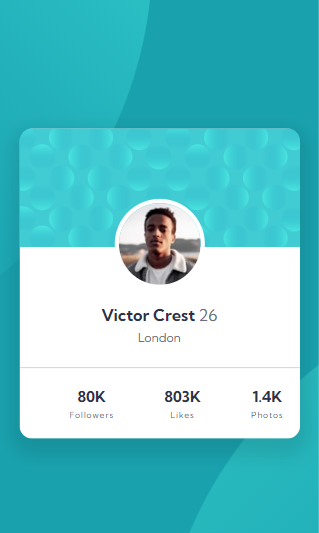

# Frontend Mentor - Profile Card Component Solution

This is a solution to [Profile Card Component Challenge in Frontend Mentor] (https://www.frontendmentor.io/challenges/profile-card-component-cfArpWshJ). Frontend Mentor challenges help you improve your coding skills by creating realistic projects.

## Table of Contents

- [Frontend Mentor - Profile Card Component Solution](#frontend-mentor---profile-card-component-solution)
  - [Table of Contents](#table-of-contents)
  - [Overview](#overview)
    - [The challenge](#the-challenge)
    - [Screenshot](#screenshot)
    - [Links](#links)
  - [my process](#my-process)
    - [Built with](#built-with)
    - [What I learned](#what-i-learned)
    - [Useful Resources](#useful-resources)
  - [Author](#author)


## Overview

### The challenge

- Build the project to the layouts provided for the profile card component.

### Screenshot

Profile card capture for desktop.


Screenshot of the profile card for mobile.


### Links

- Solution URL: [https://github.com/GustavoSDS/profile-card-component-main]
- Live Site URL: [https://coruscating-cannoli-fb9ee6.netlify.app/]

## my process

### Built with

- Semantic HTML5 markup
- CSS custom properties
- flexible box
- Mobile first workflow


### What I learned

Use this section to recap some of your main learnings while working on this project. Writing them down and providing code examples of the areas you want to highlight is a great way to reinforce your own knowledge.

-I'm not used to using pure css. For this project I had to learn the use of many CSS components. In particular, I have learned to use flexbox, grid, and the use of media queries. This helped me improve my development process.

I'm not sure if these are the correct styles for the `<hr>` tag in this project, but they are the ones I used.
```html
  <hr />
```
```css
  hr {
  border: 0;
  height: 1px;
  opacity: 0.5;
  background-color: var(--darkGray);
}
```

### Useful Resources

- [Resource 1](http://thomashw.github.io/blog/2013/07/22/styling-a-horizontal-rule/) - This helped me style the `<hr>` htm tag
- [Resource 2](https://css-tricks.com/snippets/css/a-guide-to-flexbox/) - This helped me learn the flexbox
## Author

- Website - [Gustavo S. Dos Santos] (https://coruscating-cannoli-fb9ee6.netlify.app/)
- Frontend Mentor - [@GustavoSDS](https://www.frontendmentor.io/profile/GustavoSDS)